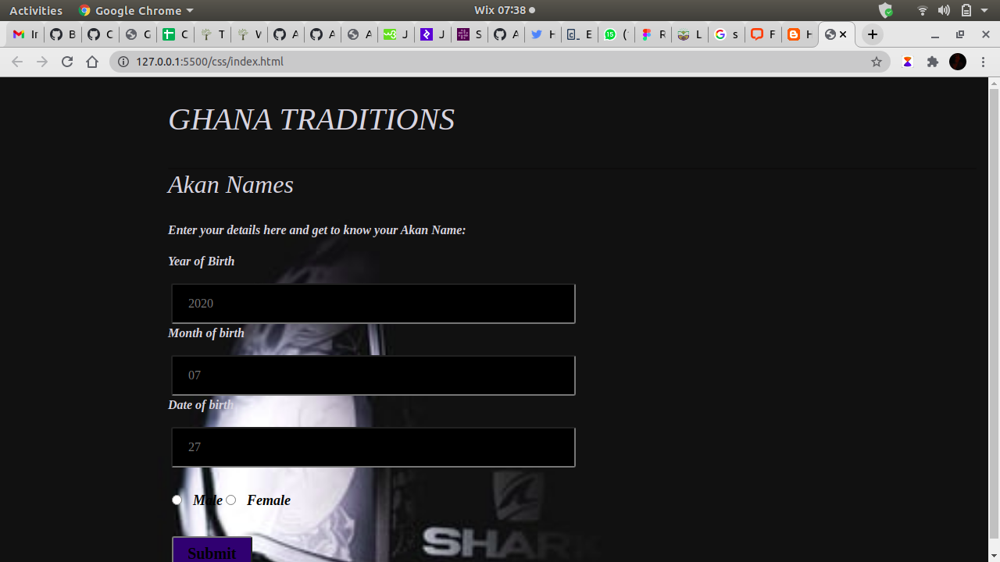

# _GHANA_
# _Akan-Names_
_These are names derived from the culture of Ghana, Children used to be named according to the day they were born. Like for example, a male child born on Monday would be called Kwadwo and a female child would be given the name Akosua. This website allows the user to enter his/her birthday and he/she gets to know the name that should have been given._

# _Author_
_The website was brought up in December 2020 by Clifford Morara. The Author  was brought up in Kenya and learnt Was a researcher in the culture of different countries._
***

# _Image of website_

 
 ## _Visit website_
 [Ghana traditions](https://cliffordmorara47.github.io/Landing-page/ "culture")
 ***

 # _Technologies Used_
 >_The following technologies were used to come up with the website._

 1. [Javascript](https://en.wikipedia.org/wiki/JavaScript "JS")

 2. [HTML5](https://en.wikipedia.org/wiki/HTML5 "Hypertext")

 3. [CSS](https://en.wikipedia.org/wiki/CSS "stylesheet")

 4. [Bootstrap](https://getbootstrap.com/ "bootstrap")
 5. [Markdown](https://en.wikipedia.org/wiki/Markdown "README.md")

